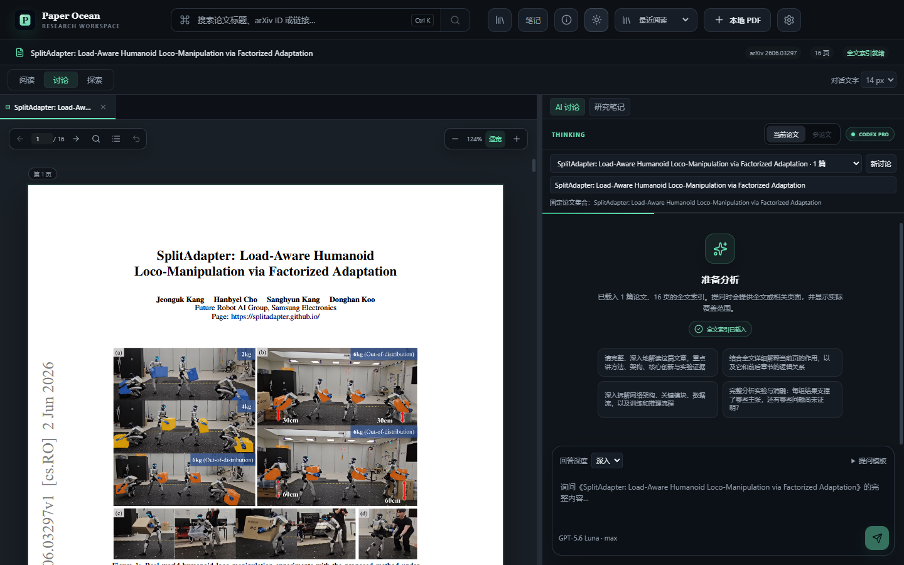

# Paper Ocean

> **v1.1.0 预览开发中**：增加 Ubuntu `.deb` / AppImage 打包与“看过 / 问过”的跨设备论文池。三平台共用主要代码；同步不包含 PDF 或问答正文。安装、连接方式及当前验证边界见 [Ubuntu 与论文池说明](docs/ubuntu-paper-pool.md)。

Paper Ocean 是一个面向 Windows 与 macOS 的本地优先论文阅读器：保留阅读位置，用自己的 ChatGPT/Codex 订阅讨论固定的一组论文，并把结论连回原文与研究笔记。

> **v1.0.0 · 大版本迭代**：从论文阅读器升级为贯通发现、阅读、讨论、证据笔记与本地归档的研究工作台。

以下能力适用于 v1.0.0 源码。本次提交不自动发布安装包；旧版 v0.4.0 安装包不包含这些升级。使用新版请从源码运行或自行打包。变更见 [v1.0.0 迭代说明](docs/v1.0.0.md)，验证进度见 [实施记录](docs/implementation-progress.md)。



## 核心创新点

这些是本项目围绕真实阅读流程形成的产品设计与工程实现，并非声称某项技术为行业首创。

### 1. 阅读连续性成为工作台的基础

阅读、讨论、探索三种布局共享同一份阅读状态。PDF 记录页内比例位置与缩放，对话记录消息及段落位置；切换论文、调整栏宽或重新打开时可以接着读。查看引用后可返回原位置，新回答也不会强行把正在阅读旧内容的人拉到底部。

### 2. 讨论绑定论文集合与版本

每个讨论绑定创建时确定的论文集合，关闭标签不改变 AI 的讨论范围。PDF 按内容区分身份，不同版本保留各自的记录；讨论名称、草稿、模板和阅读偏好独立保存，避免多篇阅读时上下文混杂。

### 3. 从 AI 解释回到可核对的原文证据

先在本地建立逐页文字索引，长文再按问题选择相关节选，并展示实际覆盖范围。问题可以附带最多三张原文页图；回答支持 Markdown、LaTeX 和可点击的跨论文页码引用。引用用于回查，不替代人工核实；扫描页暂不自动 OCR。

### 4. 从高亮到可带走的研究笔记

高亮保留页码与坐标，笔记可关联多篇论文、多页证据，也可由 AI 回答生成后继续编辑。导出 Markdown，或包含原文页图与坐标信息的 ZIP，让阅读成果能进入后续写作，而不只留在聊天记录里。

### 5. 像浏览器一样找论文

输入标题片段即可下拉联想：本地立即匹配，停顿后再联网检索；支持词序变化与少量拼写错误。`Ctrl/⌘ K` 聚焦搜索，方向键选择，Enter 打开，Escape 收起，一键清空后继续输入。中文输入法选字不会误提交。在线服务失败有备用检索路径，无可导入 PDF 时提供来源页。

### 6. 对话触发的具身智能论文归档

有过已保存提问的论文自动复制到 Windows 的 `D:\paper`，历史讨论也会补齐；多论文讨论按绑定集合归档。按**运动控制、动作生成、VLA、世界模型**分类，不确定的进入“待分类”。当前采用本地标题、摘要及已有页文字规则，支持人工纠正；内容校验避免覆盖不同文件。归档保存 PDF，对话与笔记仍在应用数据目录。

### 7. 有来源、有边界的论文发现

“近期进展”与“基础工作”分开：前者筛选近三个自然年的相关候选，后者沿数据库参考文献关系查找。推荐展示来源，缓存和后台队列减少重复请求；缩略图接近可视区域才生成，打开论文时复用下载文件。候选关系不冒充已证实的学术继承关系。

### 8. 保护本地成果的可靠性设计

原件由资料库管理，源文件移动后仍可阅读；重新定位校验内容，避免把另一个版本接到旧记录上。串行与原子保存、损坏备份恢复、关闭前保存及 Web 多页面冲突保护，减少静默丢失。下载支持进度、暂停和经服务器验证的续传；字体与 PDF 解码资源随应用打包。

### 9. 克制的交互与订阅工作流

保留明暗主题及原有绿色强调色，布局选择滑块、搜索浮层和对话框使用短时过渡；键盘焦点清晰，遵循系统“减少动态效果”设置，PDF 与流式回答正文不反复做入场动画。通过本机 Codex 使用自己的 ChatGPT 登录，当前固定 **GPT-5.6 Luna · max**；可用性由当前客户端与账户决定，应用不要求填写 API Key。

## 系统要求

- Windows 10/11 x64，或 macOS 12 及以上版本。
- 应用窗口最小为 1180 × 720；三栏同时阅读建议使用 1440 × 900 或更大的显示区域。
- 顶栏使用系统原生窗口控制：Windows 保留最小化、最大化和关闭按钮，macOS 为交通灯预留安全区；顶栏空白处可拖动窗口，表单与按钮仍可正常交互。

## 它能做什么

- 打开本地 PDF，或粘贴 arXiv 链接 / ID；保留明确版本，下载可查看进度、暂停和续传。
- 顶栏支持论文标题模糊搜索与下拉联想；先匹配本地资料库，再查询在线论文，方向键和回车即可打开。
- 有过对话的论文自动另存 PDF 到 Windows 的 `D:\paper`，按运动控制、动作生成、VLA、世界模型归档；支持手动改分类和补齐历史记录。
- 资料库支持搜索、阅读状态、作者与日期筛选排序；管理原件副本，源文件移动后仍可阅读。
- 阅读、讨论、探索三种布局；恢复 PDF 页内位置、缩放与对话段落位置。
- PDF 连续滚动、全文文字查找、目录、内部链接和返回跳转前的位置；离线字体与图像解码资源随应用打包。
- 独立命名的讨论绑定创建时的论文集合；关闭标签不会改变已有讨论范围。草稿、问题导航和对话搜索随讨论保存。
- 长文按问题检索并显示实际覆盖范围；附带最多三张原文页图，支持可点击的跨论文页码引用。扫描页不含自动 OCR。
- 高亮与研究笔记可关联多篇、多页证据；AI 回答可转为笔记，导出 Markdown 或包含原文页图和坐标的 ZIP。
- 明暗双主题一键切换，并记住你的选择；首次启动会自动采用系统当前配色。
- 回答深度与提问模板可以编辑；解读强调方法、架构、实验证据及局限。
- “近期进展”提供近三个自然年的相关候选；“基础工作”沿数据库参考文献关系查找。展示来源、复用缓存，失败时保留已有结果。
- 阅读固定使用 GPT-5.6 Luna、max；不提供模型和思考强度切换。需当前 Codex 客户端支持该配置；不可用时提示重试，不自动切换。
- 自动保存、损坏备份恢复与 Web 多页面冲突保护；更新入口只在手动检查时联网。

操作方法和边界见 [阅读与笔记工作流](docs/reading-workflow.md)。

## 用 Chrome 快速预览（推荐用于当前迭代）

网页预览会在本机运行与桌面版相同的真实论文和 Codex 后端，不是固定论文或模拟 AI 数据。第一次使用需要安装 [Node.js 22](https://nodejs.org/) 和 npm，然后在 PowerShell 或终端运行：

```bash
git clone https://github.com/SII-k7/Paper-Ocean.git
cd Paper-Ocean
npm ci
npm run web
```

保持这个终端窗口开启，并在 Chrome 输入：

```text
http://127.0.0.1:5173
```

之后修改代码时，页面会通过 Vite HMR 自动刷新；通常不需要重新下载或打包 EXE。需要停止时，回到终端按 `Ctrl+C`。桌面窗口开发方式仍然是 `npm run dev`。

网页预览继续调用你电脑上的 Codex CLI，并使用它当前登录的 ChatGPT 订阅；不需要在网页中填写 API Key。请先按下文步骤安装并登录 Codex。若启动终端找不到 `codex`，可以在运行命令前通过 `PAPER_OCEAN_CODEX_PATH` 环境变量指定 Codex CLI 的完整路径，再重新执行 `npm run web`。网页预览的论文和对话数据保存在项目内被 Git 忽略的 `.paper-ocean-dev/` 目录，与正式安装版的数据相互隔离。

> 安全提示：网页服务只应监听 `127.0.0.1`。不要把地址改成 `0.0.0.0`，也不要使用端口转发、内网穿透、Tunnel 或公开代理将它暴露到其他设备或互联网；该模式的设计边界是仅供当前电脑本地使用。

## 下载安装

前往 [GitHub Releases](https://github.com/SII-k7/Paper-Ocean/releases) 下载对应系统的文件。发布页同时提供 `SHA256SUMS.txt`，可用它核对下载完整性。

### Windows

1. 下载 `Paper-Ocean-0.4.0-win-x64.exe`。
2. 双击即可运行，不需要安装。
3. 当前便携版没有商业代码签名；若 SmartScreen 提示，请先确认文件来自本仓库的 Release，再选择“更多信息”继续运行。

### macOS

1. 下载 `Paper-Ocean-0.4.0-mac-universal.dmg`。
2. 打开 DMG，将 Paper Ocean 拖到 Applications（应用程序）。
3. 第一次启动时，macOS 可能因应用尚未签名、尚未公证而阻止打开。先尝试打开一次，然后进入“系统设置 → 隐私与安全性”，在相应提示旁选择“仍要打开”。只应对从本仓库 Release 下载并核对过校验和的文件这样操作。

该预览版最低目标为 macOS 12，并包含 Apple Silicon (`arm64`) 与 Intel (`x86_64`) 两种架构。未签名 DMG 适合本地试用，不等同于经过 Apple Developer ID 签名和公证的正式发行版。

## 使用自己的 ChatGPT 订阅

Paper Ocean 不要求你把 API Key 填入应用。它在本机调用 Codex CLI，因此需要先安装 Codex，并让 Codex 登录你的 ChatGPT 账户。

Paper Ocean 安装包不内置 Codex CLI，也不会替你创建 OpenAI 账户；安装或更新 Codex 后，重新打开 Paper Ocean 即可让应用自动发现它。

### 1. 安装 Codex CLI

Windows 和 macOS 都可以使用 npm：

```bash
npm install -g @openai/codex
```

macOS 也可以使用官方独立安装器：

```bash
curl -fsSL https://chatgpt.com/codex/install.sh | sh
```

安装和更新方式以 [Codex CLI 官方文档](https://learn.chatgpt.com/docs/codex/cli) 为准。

### 2. 登录 ChatGPT

在 PowerShell 或终端运行：

```bash
codex login
```

浏览器打开后选择 **Sign in with ChatGPT**，登录你希望使用的个人或工作区账户。然后确认状态：

```bash
codex login status
```

官方说明中，**Sign in with ChatGPT** 使用 ChatGPT 订阅访问，具体可用额度与模型由你的套餐、工作区权限和当时的使用限制决定；使用 API Key 则走 OpenAI Platform 的独立按量计费。若登录了错误方式，可先执行 `codex logout`，再重新执行 `codex login`。详见 [OpenAI 身份验证文档](https://learn.chatgpt.com/docs/auth)。

若浏览器回调被本机网络策略阻止，可按官方文档改用设备码登录：

```bash
codex login --device-auth
```

设备码登录是否可用取决于个人账户安全设置或工作区管理员权限。

### 3. 打开 Paper Ocean

应用会自动寻找常见位置中的 Codex CLI。如果状态栏提示没有找到 Codex，可在应用内手动选择 `codex` 可执行文件。之后打开一篇 PDF，等待全文索引完成即可提问。

## 隐私与数据边界

- PDF 阅读、全文抽取、索引、阅读位置和会话元数据保存在本机 Electron `userData` 目录。
- 当你向 AI 提问时，该讨论所绑定论文的提取文字或检索节选、你的问题，以及本轮附带的原文页图会通过本机 Codex 发送给 OpenAI。不要导入你无权上传或高度敏感的材料。
- arXiv 下载和相关论文推荐需要访问互联网；已下载 PDF 的基础阅读不需要联网。
- 推荐缩略图只在卡片接近可视区域时生成；预览用 PDF 与缩略图会缓存在本机，随后打开同一论文时会复用文件。超过自动预览大小上限的论文仍可正常点击打开，但卡片会显示占位图。
- ChatGPT/Codex 凭据由 Codex 自己管理。Paper Ocean 不读取你的密码，也不要求把凭据写入项目目录。
- Codex 的数据处理方式跟随你的登录方式和 ChatGPT 工作区策略；请结合 [OpenAI 身份验证文档](https://learn.chatgpt.com/docs/auth) 查看适用于你的规则。
- 当前版本限制单个 PDF 不超过 100 MB。

## 从源码运行

需要 Node.js 22、npm 和已安装的 Codex CLI。

Chrome 本地预览（适合快速迭代，无需重新打包）：

```bash
git clone https://github.com/SII-k7/Paper-Ocean.git
cd Paper-Ocean
npm ci
npm run web
```

然后在 Chrome 打开 `http://127.0.0.1:5173`。

Electron 桌面窗口开发模式：

```bash
git clone https://github.com/SII-k7/Paper-Ocean.git
cd Paper-Ocean
npm ci
npm run dev
```

生产模式：

```bash
npm run build
npm start
```

验证：

```bash
npm test
npm run check
```

`npm run smoke` 会使用当前登录账户发出一次真实 Codex 请求，并访问论文服务；它不会在 CI 中自动运行。

## 本地打包

Windows x64 便携版（在 Windows 上运行）：

```bash
npm run dist:win
```

macOS universal 未签名预览版（必须在 macOS 上运行；无需签名 secrets）：

```bash
npm run dist:mac
```

产物写入 `release/`。推送 `v*` 标签后，GitHub Actions 会在 Windows 与 Intel macOS runner 上分别构建、校验、生成 SHA-256 校验和，并创建预发布 Release；手动运行工作流时只上传可下载的 Actions artifacts，不会创建 Release。

## 发布边界

- 当前 macOS 包明确关闭代码签名、Hardened Runtime 和 notarization，以保证没有 Apple 签名 secrets 时也能构建预览 DMG。
- 面向普通用户正式分发前，应配置 Apple Developer ID、启用 Hardened Runtime 并完成 notarization；届时可移除 Gatekeeper 绕行说明。
- Windows 便携版当前同样未配置商业代码签名，首次运行可能出现 SmartScreen 提示。
