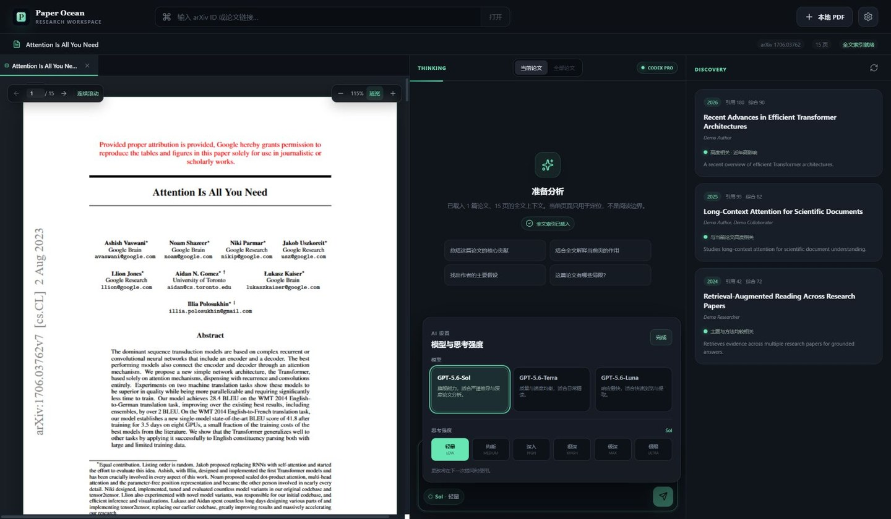

# Paper Ocean

Paper Ocean 是一个面向 Windows 与 macOS 的本地优先论文阅读器：左侧连续阅读多篇 PDF，中间用你自己的 ChatGPT/Codex 订阅讨论论文，右侧沿相关工作继续探索。

> 当前版本：v0.4.0。Windows 提供 x64 便携版；macOS 提供同时支持 Apple Silicon 与 Intel 的 universal 未签名预览版 DMG。



## 系统要求

- Windows 10/11 x64，或 macOS 12 及以上版本。
- 应用窗口最小为 1180 × 720；三栏同时阅读建议使用 1440 × 900 或更大的显示区域。
- 顶栏使用系统原生窗口控制：Windows 保留最小化、最大化和关闭按钮，macOS 为交通灯预留安全区；顶栏空白处可拖动窗口，表单与按钮仍可正常交互。

## 它能做什么

- 打开本地 PDF，或粘贴 arXiv 链接 / ID 下载论文。
- 三栏并行阅读：PDF、AI 对话、相关论文推荐。
- PDF 多页连续滚动、页码跟随、跳页、缩放和文本选择。
- 为每篇论文建立完整的本地全文索引；当前页和选中文本作为额外线索。
- 同时打开多篇论文，在“当前论文”和“全部论文”两种独立对话上下文间切换。
- 明暗双主题一键切换，并记住你的选择；首次启动会自动采用系统当前配色。
- 面向论文阅读优化的 AI 解读协议：概览类问题会重点讲清方法、网络/系统架构、核心创新、实验证据与局限，并尽可能给出页码依据。
- 相关论文只保留近三年结果，综合关联度与知名度排序；卡片会按需生成论文首页缩略图，也可直接在新标签中打开。
- 模型和思考强度可在应用内切换；实际可用项由当前 Codex 账户决定。

## 用 Chrome 快速预览（推荐用于当前迭代）

网页预览会在本机运行与桌面版相同的真实论文和 Codex 后端，不是固定论文或模拟 AI 数据。第一次使用需要安装 [Node.js 22](https://nodejs.org/) 和 npm，然后在 PowerShell 或终端运行：

```bash
git clone https://github.com/SII-k7/Paper-Ocean.git
cd Paper-Ocean
npm ci
npm run web
```

保持这个终端窗口开启，并在 Chrome 输入：

```text
http://127.0.0.1:5173
```

之后修改代码时，页面会通过 Vite HMR 自动刷新；通常不需要重新下载或打包 EXE。需要停止时，回到终端按 `Ctrl+C`。桌面窗口开发方式仍然是 `npm run dev`。

网页预览继续调用你电脑上的 Codex CLI，并使用它当前登录的 ChatGPT 订阅；不需要在网页中填写 API Key。请先按下文步骤安装并登录 Codex。若启动终端找不到 `codex`，可以在运行命令前通过 `PAPER_OCEAN_CODEX_PATH` 环境变量指定 Codex CLI 的完整路径，再重新执行 `npm run web`。网页预览的论文和对话数据保存在项目内被 Git 忽略的 `.paper-ocean-dev/` 目录，与正式安装版的数据相互隔离。

> 安全提示：网页服务只应监听 `127.0.0.1`。不要把地址改成 `0.0.0.0`，也不要使用端口转发、内网穿透、Tunnel 或公开代理将它暴露到其他设备或互联网；该模式的设计边界是仅供当前电脑本地使用。

## 下载安装

前往 [GitHub Releases](https://github.com/SII-k7/Paper-Ocean/releases) 下载对应系统的文件。发布页同时提供 `SHA256SUMS.txt`，可用它核对下载完整性。

### Windows

1. 下载 `Paper-Ocean-0.4.0-win-x64.exe`。
2. 双击即可运行，不需要安装。
3. 当前便携版没有商业代码签名；若 SmartScreen 提示，请先确认文件来自本仓库的 Release，再选择“更多信息”继续运行。

### macOS

1. 下载 `Paper-Ocean-0.4.0-mac-universal.dmg`。
2. 打开 DMG，将 Paper Ocean 拖到 Applications（应用程序）。
3. 第一次启动时，macOS 可能因应用尚未签名、尚未公证而阻止打开。先尝试打开一次，然后进入“系统设置 → 隐私与安全性”，在相应提示旁选择“仍要打开”。只应对从本仓库 Release 下载并核对过校验和的文件这样操作。

该预览版最低目标为 macOS 12，并包含 Apple Silicon (`arm64`) 与 Intel (`x86_64`) 两种架构。未签名 DMG 适合本地试用，不等同于经过 Apple Developer ID 签名和公证的正式发行版。

## 使用自己的 ChatGPT 订阅

Paper Ocean 不要求你把 API Key 填入应用。它在本机调用 Codex CLI，因此需要先安装 Codex，并让 Codex 登录你的 ChatGPT 账户。

Paper Ocean 安装包不内置 Codex CLI，也不会替你创建 OpenAI 账户；安装或更新 Codex 后，重新打开 Paper Ocean 即可让应用自动发现它。

### 1. 安装 Codex CLI

Windows 和 macOS 都可以使用 npm：

```bash
npm install -g @openai/codex
```

macOS 也可以使用官方独立安装器：

```bash
curl -fsSL https://chatgpt.com/codex/install.sh | sh
```

安装和更新方式以 [Codex CLI 官方文档](https://learn.chatgpt.com/docs/codex/cli) 为准。

### 2. 登录 ChatGPT

在 PowerShell 或终端运行：

```bash
codex login
```

浏览器打开后选择 **Sign in with ChatGPT**，登录你希望使用的个人或工作区账户。然后确认状态：

```bash
codex login status
```

官方说明中，**Sign in with ChatGPT** 使用 ChatGPT 订阅访问，具体可用额度与模型由你的套餐、工作区权限和当时的使用限制决定；使用 API Key 则走 OpenAI Platform 的独立按量计费。若登录了错误方式，可先执行 `codex logout`，再重新执行 `codex login`。详见 [OpenAI 身份验证文档](https://learn.chatgpt.com/docs/auth)。

若浏览器回调被本机网络策略阻止，可按官方文档改用设备码登录：

```bash
codex login --device-auth
```

设备码登录是否可用取决于个人账户安全设置或工作区管理员权限。

### 3. 打开 Paper Ocean

应用会自动寻找常见位置中的 Codex CLI。如果状态栏提示没有找到 Codex，可在应用内手动选择 `codex` 可执行文件。之后打开一篇 PDF，等待全文索引完成即可提问。

## 隐私与数据边界

- PDF 阅读、全文抽取、索引、阅读位置和会话元数据保存在本机 Electron `userData` 目录。
- 当你向 AI 提问时，所选论文的文本上下文、你的问题，以及需要时的当前页线索会通过本机 Codex 发送给 OpenAI。不要导入你无权上传或高度敏感的材料。
- arXiv 下载和相关论文推荐需要访问互联网；已下载 PDF 的基础阅读不需要联网。
- 推荐缩略图只在卡片接近可视区域时生成；预览用 PDF 与缩略图会缓存在本机，随后打开同一论文时会复用文件。超过自动预览大小上限的论文仍可正常点击打开，但卡片会显示占位图。
- ChatGPT/Codex 凭据由 Codex 自己管理。Paper Ocean 不读取你的密码，也不要求把凭据写入项目目录。
- Codex 的数据处理方式跟随你的登录方式和 ChatGPT 工作区策略；请结合 [OpenAI 身份验证文档](https://learn.chatgpt.com/docs/auth) 查看适用于你的规则。
- 当前版本限制单个 PDF 不超过 100 MB。

## 从源码运行

需要 Node.js 22、npm 和已安装的 Codex CLI。

Chrome 本地预览（适合快速迭代，无需重新打包）：

```bash
git clone https://github.com/SII-k7/Paper-Ocean.git
cd Paper-Ocean
npm ci
npm run web
```

然后在 Chrome 打开 `http://127.0.0.1:5173`。

Electron 桌面窗口开发模式：

```bash
git clone https://github.com/SII-k7/Paper-Ocean.git
cd Paper-Ocean
npm ci
npm run dev
```

生产模式：

```bash
npm run build
npm start
```

验证：

```bash
npm test
npm run check
```

`npm run smoke` 会使用当前登录账户发出一次真实 Codex 请求，并访问论文服务；它不会在 CI 中自动运行。

## 本地打包

Windows x64 便携版（在 Windows 上运行）：

```bash
npm run dist:win
```

macOS universal 未签名预览版（必须在 macOS 上运行；无需签名 secrets）：

```bash
npm run dist:mac
```

产物写入 `release/`。推送 `v*` 标签后，GitHub Actions 会在 Windows 与 Intel macOS runner 上分别构建、校验、生成 SHA-256 校验和，并创建预发布 Release；手动运行工作流时只上传可下载的 Actions artifacts，不会创建 Release。

## 发布边界

- 当前 macOS 包明确关闭代码签名、Hardened Runtime 和 notarization，以保证没有 Apple 签名 secrets 时也能构建预览 DMG。
- 面向普通用户正式分发前，应配置 Apple Developer ID、启用 Hardened Runtime 并完成 notarization；届时可移除 Gatekeeper 绕行说明。
- Windows 便携版当前同样未配置商业代码签名，首次运行可能出现 SmartScreen 提示。
