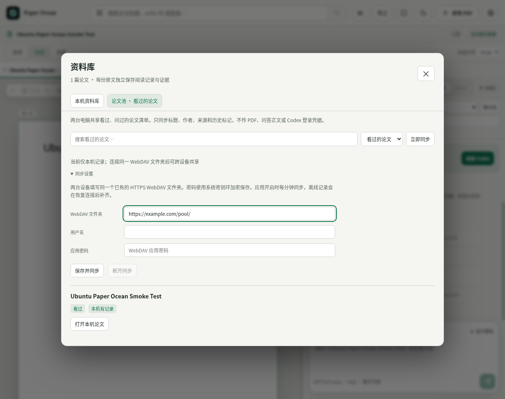

# Ubuntu 预览版与最小论文池

v1.1.0 预览。Windows、Ubuntu、macOS 共用 React 界面、PDF 阅读、Codex 服务、资料库与论文池；系统差异集中在已有的平台分支和打包配置中。没有复制一套 Linux 产品代码。



## 本轮验证记录

最终代码 `9e6c8c2`：**110 项测试通过**，包括合并后容量限制与确定性并发冲突验证；[Ubuntu 双版本最终包](https://github.com/SII-k7/Paper-Ocean/actions/runs/34221955991)和 [Windows 最终包](https://github.com/SII-k7/Paper-Ocean/actions/runs/34221956016)均构建成功。下载构建页 Artifacts 中的压缩包并解压后安装。以下链接保留此前实机截图验收记录。

- [Ubuntu 22.04 / 24.04 构建与安装验证](https://github.com/SII-k7/Paper-Ocean/actions/runs/34220528714)：两项通过。每个平台 109 项自动测试通过；deb 实际安装后启动窗口，导入测试 PDF、渲染画布、建立全文索引、显示看过的论文，验证预加载桥接和设置入口。中文字体依赖安装后截图确认无方框字。
- [Windows 配套包](https://github.com/SII-k7/Paper-Ocean/actions/runs/34220940981)：109 项测试、类型检查与打包通过；本机另用独立桌面资料库验证了论文池筛选、设置错误提示，以及完全没有本地 PDF 时显示远端“问过”条目。
- 双客户端同步测试通过真实 HTTP 传输模拟条件写入服务，验证并发写入冲突重试、离线后重启补齐与字段白名单。测试使用隔离目录与虚拟论文，不上传用户阅读记录。
- 目前未接入用户的真实 WebDAV；实际两台设备的地址与凭据需要在应用内配置。CI 未使用个人账户发起真实 AI 问答，真实桌面输入法、GPU、钥匙串和具体 WebDAV 服务仍需环境验收。macOS 本轮未实机测试。

## Ubuntu 安装

目标为 Ubuntu 22.04／24.04 x64。优先使用 `.deb`；AppImage 为便携候选。当前预览产物在 [Ubuntu 构建记录](https://github.com/SII-k7/Paper-Ocean/actions/workflows/linux-preview.yml) 的成功运行附件中，需登录 GitHub 下载。

```bash
sudo apt install ./Paper-Ocean-1.1.0-linux-amd64.deb
```

安装后从应用菜单打开 Paper Ocean。应用使用本机 Codex CLI；先按 [官方说明](https://learn.chatgpt.com/docs/codex/cli) 安装并登录。支持常见的用户安装目录，也可在应用设置中直接选择 Codex 可执行文件。通过 nvm 安装但桌面进程没有相应 PATH 时，选择其完整路径即可。

Linux 自动归档目录默认为 `~/paper`，Windows 仍为 `D:\paper`。PDF 与问答仍保存在各自设备上。

deb 将中文字体 `fonts-noto-cjk` 作为安装依赖，避免精简英文系统出现方框字。AppImage 不安装系统依赖；缺少中文字体时运行 `sudo apt install fonts-noto-cjk`。

Ubuntu 24.04 可能限制应用使用非特权用户命名空间。当前打包器的 deb 安装脚本会按系统支持情况安装应用专属 AppArmor 配置；无需把关闭系统保护或 `--no-sandbox` 作为默认启动方法。AppImage 受本机 FUSE／沙箱策略影响，若不能启动优先安装 deb。

## 两台电脑共享论文池

入口：**资料库 → 论文池 · 看过的论文 → 同步设置**。

1. 准备一个两台设备都能访问的、已创建的 HTTPS WebDAV 文件夹。可使用自己已有的 WebDAV / Nextcloud / NAS；该服务需要支持强 ETag 与条件写入。
2. 两台电脑填写相同文件夹地址、用户名和 WebDAV 应用密码，点击“保存并同步”。应用只创建／更新该目录下的 `paper-ocean-pool-v1.json`，不会上传目录里的其他文件。
3. 在一台设备上打开或提问后，记录会自动更新。另一台设备可点“立即同步”，或保持应用开启等待后台同步（约每分钟一次）。

只同步论文标题、作者、来源、arXiv 版本、内容 ID 与看过／问过时间。不传 PDF、全文索引、页图、问答正文、笔记、Codex 会话或登录凭据。WebDAV 密码在本地使用系统密钥环加密保存，不放进论文池文件；Ubuntu 需要可用的 GNOME Keyring 或受支持钥匙串。

另一台没有原文件时，仍显示论文条目和“仅历史记录 · 本机未导入”；可打开来源，按需自行下载。导入同字节 PDF 后自动匹配内容 ID。“看过”指曾打开，并不等于完整读完；“问过”指本机保存过用户提问，也不保证 AI 已成功回答。

第一版保留历史的并集，不同步删除，也不会让一个设备的未提问状态抹掉另一个设备的提问记录。断开同步只删除本机连接配置，已有本地和远端历史保留。更换目标文件夹会把本机现有论文池并入新目标，应使用自己的私人目录。

离线时本机阅读不受影响，重连后补齐。两个设备同时更新时以版本条件写入并重试，避免整份快照互相覆盖。错误会显示在论文池；不会把损坏数据当空列表覆盖。当前上限为 20,000 条记录、8 MB 传输文档，适合个人两台电脑的小规模同步。

Web 预览目前不参与论文池同步；这版面向用户明确使用的 Windows 与 Ubuntu 桌面端。同步功能不要求两台电脑同时在线，但需要可用的共同 WebDAV 存储。尚未配置存储时仅展示本机记录，不声称已连接另一设备。

## 开发与维护

```bash
npm ci
npm run dev
npm test
npm run check
npm run dist:linux
```

`electron/paper-pool.mjs` 是平台无关的元数据提取与合并；`electron/pool-sync.mjs` 是共用的持久化、离线与 WebDAV 传输。`electron/main.mjs` 只适配 Electron 的网络与系统密钥环，`src/components/PaperPool.tsx` 是共用界面。后续更换传输方式无需重写论文身份或界面。

测试覆盖字段白名单、固定多论文提问范围、合并一致性、双客户端竞争创建、离线重启恢复、鉴权、损坏版本和缺失 ETag 的拒绝写入。Ubuntu CI 另验证 deb 安装、真实 Electron 窗口、PDF 画布／全文索引和论文池界面；虚拟显示使用软件渲染，保持 Chromium 沙箱。真实桌面的输入法、硬件 GPU 和钥匙串仍需按实际 Ubuntu 环境验收。
