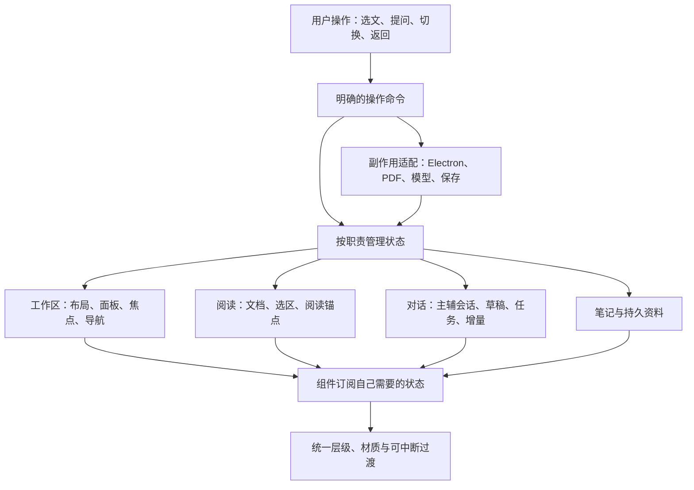
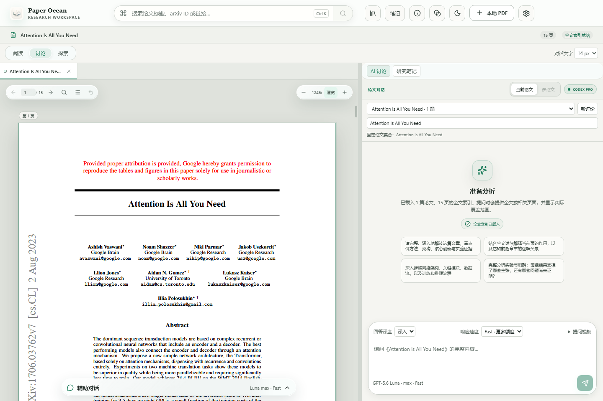
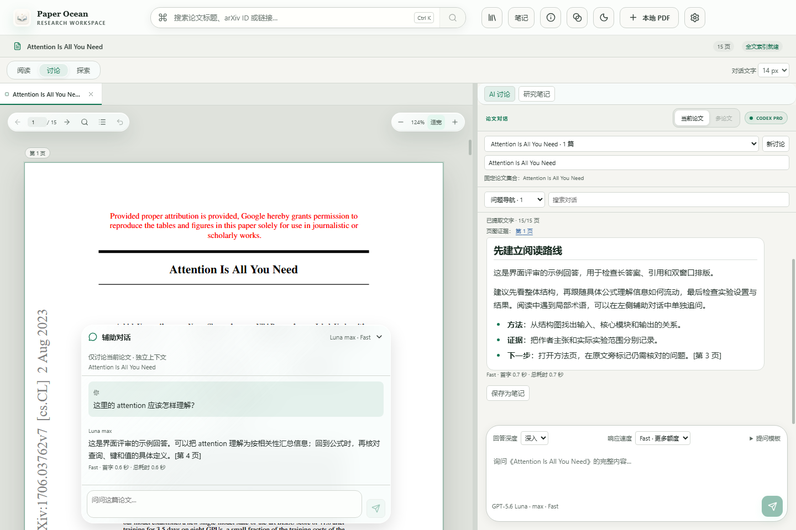
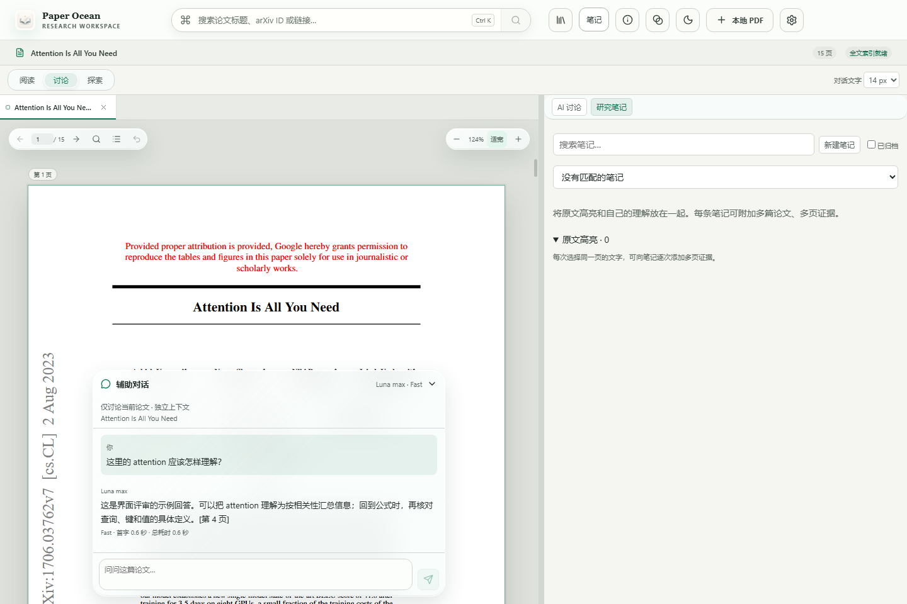
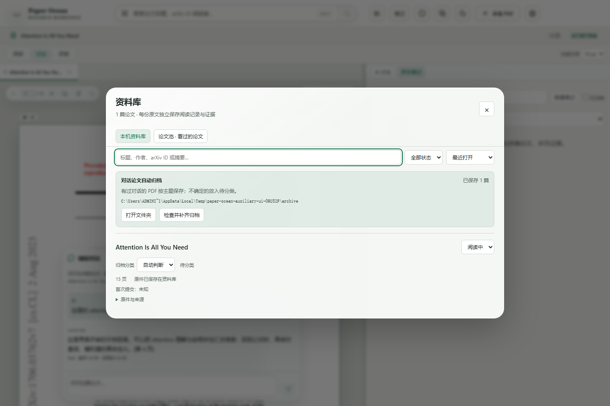
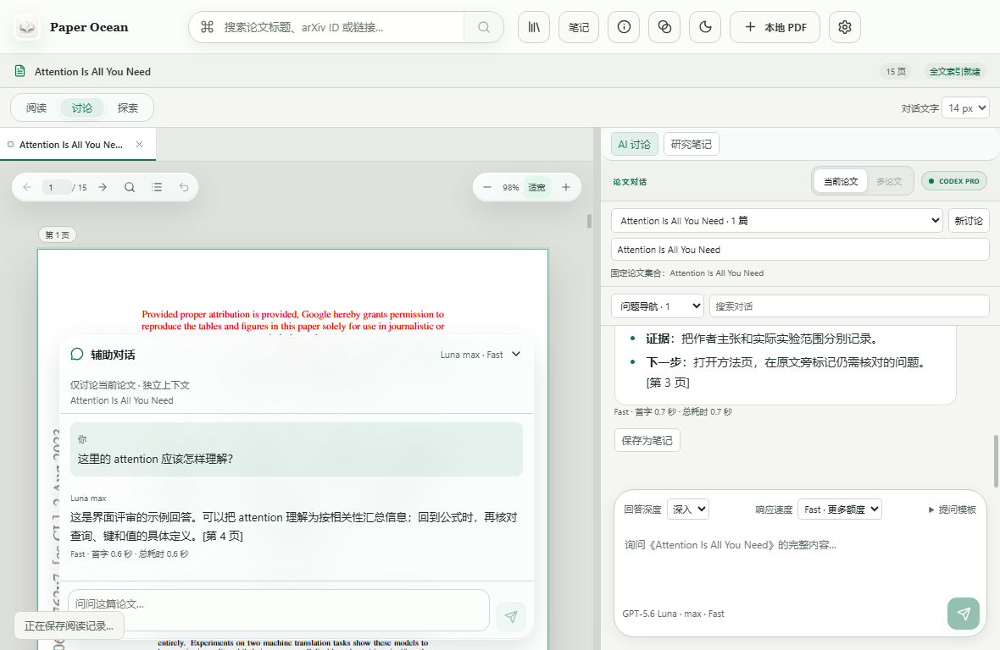

# Paper Ocean：阅读交互与 UI 架构重构方案

日期：2026-09-12。审查基线：v1.2.5 / `787b629`。本轮产物为设计与实施规划，目标是让搜索、阅读、双路问答和证据记录成为连续的操作过程。

## 1. 判断与目标

上一版补充了玻璃材质、局部过渡和状态修复，但沿用了原有的功能组织方式。当前同时存在应用工具栏、论文信息栏、布局栏、论文标签、AI/笔记切换、讨论管理和回答设置，日常阅读需要穿过多个控制层。局部按钮变精致后，整体仍容易显得零散。

高级感应落实为三种可感知的体验：

1. **安静**：原文和答案占主要空间，管理功能按需展开。
2. **连续**：操作前后能看懂对象去了哪里，展开、返回、切换不会丢失位置或上下文。
3. **跟手且可信**：输入立即反馈，拖动稳定，错误属于具体任务，后台回答和保存不会打断当前阅读。

保留产品核心：本地 PDF、跨平台、Luna max Fast、完整的论文证据输入、主辅独立上下文，以及运动控制/动作生成/VLA/世界模型自动归档。UI 重构沿用已有论文 ID、会话 ID、存储与 IPC 契约，减少迁移风险。

## 2. 本次现场审查

重新启动隔离的 Electron v1.2.5，使用本地真实 PDF；主辅答案明确标为界面评审示例。标准窗口 1440×960，窄窗口 1180×768。截图中的 0.6–0.7 秒是模拟响应，不能当作真实模型延迟。此轮没有做帧率或 GPU 性能剖析。

| 步骤 | 状态 | 观察与影响 |
| --- | --- | --- |
| 1. 打开论文 | 功能可用，层级拥挤 | 标题、标签、模式重复占据垂直空间；单论文也常驻讨论选择、改名等管理控件 |
| 2. 双路对话 | 上下文独立，主次仍偏弱 | 模型标识、设置、状态和边框在多个区域重复；输入框与管理区挤压回答阅读面积 |
| 3. 切到笔记 | 功能可用，任务割裂 | 右侧主对话被完整替换；现有保存回答流程也会主动切到笔记，容易打断原思路 |
| 4. 打开资料库 | 功能可用，遮挡较重 | 日常换论文要进入遮住工作区的大对话框；归档路径与管理项位于列表上方 |
| 5. 缩小窗口 | 控件仍可操作，内容面积不足 | 管理区域维持多行，辅助窗口固定展开高度占比增大，阅读空间明显缩减 |

窄窗口中的辅助覆盖本身符合原需求；改造重点是改善默认比例并允许主动调整，而不是取消覆盖。截图显示字体与部分小控件存在可读性风险，但不能据此声明对比度或无障碍标准不合格，需要尺寸和对比度测量。

## 3. 推荐的工作台结构

### 默认界面

- **顶部一条紧凑工具栏**：导航入口、搜索、当前论文和必要状态。标题不在多个栏位反复出现；仅在多论文时显示独立标签条。
- **左侧原文、右侧主对话**：保留用户熟悉的布局。主对话顶部只常驻“本讨论基于哪些论文”、历史入口与更多操作。改名、模型细节、模板管理放入相应菜单。
- **论文底部辅助对话**：保留折叠条，展开始终锚定原位置。默认高度随阅读区调整，支持手动扩展及记忆偏好；辅助窗展开不挤动 PDF 排版。
- **资料库/发现可收起**：作为工作区导航面板，可固定；临时选论文时覆盖导航侧，选中后回到阅读。窄窗口同一时间只展开一项次级工具。
- **笔记就地收集、按需编辑**：保存答案先给出“已保存 · 查看 · 撤销”，保持正在看的对话。主动查看后再打开笔记编辑面板，默认聚焦当前论文。

“阅读/讨论/探索”保留为工作区布局预设，收敛到一个入口；不再与其他同级切换条争夺整行空间。需要边看发现边讨论时仍可固定第三栏。

### 上下文必须明确

**正在阅读的论文和对话绑定的论文是两种状态。** 点击另一篇论文的引用可以切换 PDF，但不能悄悄改变原讨论的证据集合。界面必须能同时表达“正在读 A”与“本讨论基于 B”。

选中原文后显示“问主对话 / 问辅助对话 / 记笔记”。目标输入框出现带论文、页码、摘录的附件，能够移除。各输入框拥有自己的附件；不在发送时隐式复用全局选文。

运行中的任务显示所属论文和可返回入口。打开另一篇论文不会让旧问题的状态消失，也不会把停止按钮指向错误任务。

## 4. 交互应如何连接起来

| 操作 | 用户应感受到的行为 | 需要的状态约定 |
| --- | --- | --- |
| 搜索并打开 | 已选结果立即确认；论文标签先建立，内容就绪后填入稳定容器 | 区分已选择、下载中、可阅读、索引就绪；保留取消与失败重试 |
| 选文提问 | 从选区进入指定输入框，来源始终可见 | 选文是显式附件快照，带 paperId/page/anchor，归属某个 composer |
| 展开辅助对话 | 折叠条沿原位置展开，重复点击可反向收起 | 展示态独立于生成态；关闭视图不会取消生成或清空草稿 |
| 点击证据 | 原文定位到证据，保留清楚的返回入口 | 记录来源对话、阅读锚点、焦点；跳转不改变 scopeKey |
| 保存笔记 | 原位置收到成功反馈，可以继续读或撤销 | 保存结果与编辑面板显示分开；失败时保留原内容 |
| 拖动分栏 | 边界贴着指针移动，原文不反复闪白 | 拖动预览、最终几何尺寸、PDF 清晰重绘分阶段处理 |
| 切论文或重启 | 回到刚才的阅读位置、对话和草稿 | 已提交阅读位置和每路草稿持久化；旧异步结果不能覆盖新对象 |

动效从对象关系出发：浮窗从触发处出现，导航表达方向，保存反馈发生在操作附近。正文持续输出时不逐字做入场动画；文本本身保持清楚。出现/消失能够中断、反转，事件处理不等待动画结束。

## 5. UI 驱动架构

这不是一个管理所有事情的巨大状态机。工作区显示、论文加载、两路回答、保存分别拥有自己的状态；协调器只描述跨模块操作的顺序和归属。

### 状态与责任边界

| 模块 | 独占职责 | 不应承担 |
| --- | --- | --- |
| WorkspaceController | 当前阅读对象、可见面板、布局预设、焦点恢复、导航意图 | 逐字回答、PDF 解码、全量资料保存 |
| ReaderSession | PDF 文档生命周期、页图缓存、阅读位置和选文 | 对话绑定关系、全局弹窗 |
| ConversationController | 按 scopeKey/turnId 管理主辅生成、停止、恢复、错误 | 决定论文布局或切到笔记 |
| ComposerState | 每个输入框的草稿、附件、输入法状态 | 从全局选文推断隐式附件 |
| PersistenceAdapter | 把领域快照写入现有格式、串行保存、失败恢复、关闭屏障 | 每个视觉变化都保存 |
| Surface/Motion | 层级、锚定、进入/退出、焦点与关闭规则 | 修改会话或业务数据 |

命令携带目标身份，例如 `AskSelection(targetScope, attachment)`、`OpenEvidence(sourceScope, targetAnchor)`、`SaveAnswerAsNote(messageId)`。异步结果带 `requestId/scopeKey/turnId`，由所有者核验；显示中的论文不会被当作异步任务的隐式目标。

论文加载状态按阶段表达；生成状态按准备、等待、输出、停止中、完成、失败表达。保存失败与回答失败相互独立。状态标签由这些状态派生，避免多个布尔变量给出互相冲突的按钮。

### 技术选择

沿用 React、TypeScript、Electron 和 PDF.js。先使用局部 reducer、稳定接口和按对象订阅收敛边界；实时模型事件可用 `useSyncExternalStore` 接入小范围订阅。是否采用轻量状态库或 Motion 库，在第一条真实交互链上比较复杂度与包体后再决定。

状态库本身不保证流畅。React 官方明确：外部 store 的变化不能天然作为非阻塞 Transition，快照变化可能回退到同步更新。因此输入状态应保持局部、及时，昂贵派生视图与后台任务分别调度；不能给所有事件套一层 `startTransition` 就声称完成优化。[React 外部订阅](https://react.dev/reference/react/useSyncExternalStore)、[React Transition](https://react.dev/reference/react/startTransition)。

## 6. 为什么需要这些边界：源码证据

| 证据 | 当前事实 | 改造方向 |
| --- | --- | --- |
| [App.tsx:102](../src/App.tsx#L102)、[App.tsx:650](../src/App.tsx#L650) | 1271 行组件集中论文、选区、导航、账户、提示、两路生成与问答编排 | 按上面的状态所有权提取，App 留作工作台组装 |
| [App.tsx:417](../src/App.tsx#L417)、[useLibrary.ts:25](../src/hooks/useLibrary.ts#L25) | 每路回答约 50ms 合并后更新 library 并安排保存；草稿也走该入口 | 流式显示与持久快照分离，避免所有订阅者跟随增量变化 |
| [library-saver.mjs:3](../src/library-saver.mjs#L3) | 已有 350ms 合并、单次写入与失败保留 | 第一阶段保留可靠性契约；不是假设现在每个 token 都直接写磁盘 |
| [ResizableWorkspace.tsx:89](../src/components/ResizableWorkspace.tsx#L89) | 模式由布局内部持有，父级用请求计数触发布局切换 | 收归 WorkspaceController，统一焦点和恢复时机 |
| [ResizableWorkspace.tsx:121](../src/components/ResizableWorkspace.tsx#L121)、[PdfReader.tsx:702](../src/components/PdfReader.tsx#L702) | 栏宽变化持久化；适宽观察器更新缩放 | 区分拖动过程与提交；先剖析再优化 Canvas 重绘 |
| [PdfReader.tsx:623](../src/components/PdfReader.tsx#L623) | 切换论文时文档任务销毁并重建，已有文字索引可复用 | 探索有内存上限的少量文档缓存；取消过期渲染，保留锚点 |
| [AuxiliaryChat.tsx:29](../src/components/AuxiliaryChat.tsx#L29)、[useChatPosition.ts:6](../src/hooks/useChatPosition.ts#L6) | 主辅独立实现滚动与未读，主窗有更完整的位置恢复 | 共享行为规则，保持两个独立会话和不同展示尺寸 |
| [App.tsx:942](../src/App.tsx#L942)、[PdfReader.tsx:402](../src/components/PdfReader.tsx#L402) | 跨论文证据和 PDF 内部导航有各自的返回路径 | 统一导航命令和返回契约，PDF 内部坐标计算仍独立 |
| [glass.css:32](../src/glass.css#L32) | 后置类名覆盖提供材质，多种浮层共用出现动画 | 以组件语义定义 Surface、Popover、Sheet、Dialog 等层级 |

源码能证明更新路径和职责耦合，不能证明实际掉帧程度。v1.2.5 已有回答合并、历史 Markdown memo、PDF 可见范围渲染、适宽 rAF、减少动态效果，这些应保留并纳入对照。

## 7. 统一视觉与动效规则

先确定排版、密度和层级，再选择材质。采用一套语义变量覆盖背景、正文、次要文字、边框、强调色、间距、圆角和阴影，逐步替换跨文件覆盖。

- **内容层**：安静、清晰的原文与答案。答案优先按阅读文章排版，减少重复卡片边框。
- **工具层**：轻量悬浮控件，强调功能关系。玻璃用于少量关键控件，不铺满所有区域。
- **临时操作层**：选文菜单、搜索建议、辅助浮窗，具有明确触发点、边界和关闭规则。
- **模态层**：真正需要独立处理的设置或确认。常用导航不必反复遮住整页。

正文建议从 15–16px 的中文阅读字号起评审，区分正文与辅助标注，不把主要任务压进小字号。间距、圆角、触控区域采用统一档位；分别校验 Windows、macOS 与 Ubuntu 的字体回退。

初始动效预算：按压反馈约 80–120ms；局部浮层约 160–220ms；面板布局约 220–280ms。它们是待试用校准的设计值。拖拽直接跟随指针；减少动态效果时用即时切换或短淡入保持同样的状态语义。避免持续动画 blur、shadow 或大面积截图；如采用 FLIP/transform，只用于适合的外壳和过渡层，文字/文本选择坐标与 PDF Canvas 单独处理。

Apple 的材料规范强调用材质区分功能与内容层，并限制自定义玻璃的使用范围。这里借鉴层级与连续性，不以复刻原生渲染为验收标准。[Apple Materials](https://developer.apple.com/design/human-interface-guidelines/materials)。

## 8. 性能与可靠性计划

1. **先测量**：真实设备记录输入、双路输出、长答案、拖拽、快速切论文；区分 React 更新、布局、Canvas 渲染、IPC 保存与模型首字等待。
2. **分离高频更新**：活动回答只通知对应消息；完成段落复用结果，活动尾段谨慎增量解析。Markdown 围栏、公式、表格可跨分片，必须有整段校正路径。长历史窗口化需要先解决跳转定位、浏览器查找与阅读锚点，不能直接裁掉消息。
3. **重绘分阶段**：拖动时更新几何预览，提交后完成清晰重绘；不把每个 pointermove 都变成持久设置。PDF 缓存有明确容量和淘汰规则，防止多文档内存累积。
4. **保存独立且可靠**：运行中内容仍纳入待保存状态，保留周期快照；完成、停止、关闭时强制合并并等待保存。首阶段保留原有保存间隔，后续调节必须明确意外退出的最大数据损失窗口。

以下是目标预算，不是已取得的测量：

| 指标 | 初始验收目标 | 测量方式 |
| --- | --- | --- |
| 本地输入/选择到首个可见反馈 | p95 ≤100ms | 真实事件时间戳到呈现标记 |
| 收到回答增量到界面显示 | p95 ≤100ms | IPC 接收与消息呈现埋点 |
| 常见状态更新的 React commit | p95 ≤8ms，结合整帧观察 | React profiling 构建 |
| 60Hz 交互 | 大多数帧在 16.7ms 内，避免反复出现 >50ms 主线程任务 | Chromium Performance；不能只看截图 |
| 引用返回、展开/折叠 | 返回原页和段落；无意外滚动与焦点丢失 | 锚点误差目标 ≤8 CSS px，配合人工核对 |
| 常用内容空间 | 正常桌面内容容器从顶部约 100px 内开始 | 不将原 PDF 自带页边距算作 UI 留白 |

压力场景建议固定为双路模拟流、200 条历史、公式长答案、100 页 PDF，并明确文件规模、硬件和分辨率。冷打开和缓存打开分开测。模型的 10 秒等待与界面的 100ms 响应分别记录，动效不用于掩盖实际延迟。

## 9. 分阶段实施与验收门槛

| 阶段 | 交付物 | 进入下一阶段的条件 |
| --- | --- | --- |
| A. 交互基线与契约 | 关键状态表、视觉变量草案、现有性能记录、3 个核心状态稿 | 能明确每个对象的归属、操作入口和返回规则 |
| B. 第一条完整交互链 | 新工作台外壳中的“选文→指定辅助提问→引用→返回→就地笔记”可点击版本 | 实际体验比现版少打断、上下文清楚；窄窗口与键盘可用 |
| C. 接入真实状态与数据 | 工作区/对话控制器、按对象订阅、现有存储适配；旧界面可切回 | 旧论文/线程/草稿可恢复，双路不串线；停止重试、保存失败、关闭生成均通过 |
| D. 扩展全流程并优化 | 搜索、资料库、笔记、发现使用同一套组件与动效；按 profiling 结果优化 | 组合压力场景满足预算；没有用减少模型上下文换渲染速度 |
| E. 日常试读后发布 | 候选安装包、前后对比记录、完整回归与回退路径 | 连续读几篇真实论文，完成查词、追问、取证与笔记；确认更少误操作且主观感受改善 |

每阶段可独立审查；避免一次替换全部页面。先让一条核心路径获得可体验的提升，再迁移其余功能。新的字段应通过兼容适配增加；只在确有必要时升级存储 schema，并先做迁移备份。可切回旧界面的开关属于开发/候选版本控制，不增加用户日常操作负担。

验收除了“按钮能点”，还应检查：动画途中连续点击能否反向；主辅生成同时拖动/输入；切换 A/B 后状态是否仍归属原论文；引用回查是否误改讨论；关闭前是否保存；中文输入法是否误提交；键盘焦点是否回到触发器；减少动态、降低透明、200% 文字与高对比设置下操作是否可达。屏幕阅读器播报应按阶段和完整消息组织，不逐字重复。

第一轮体验评估采用相同任务对照：找到论文、解释选文、回查证据、存笔记、恢复阅读。记录操作次数、误触、返回原位置成功率和本人舒适度。高级感包含主观评价，需要实际试读，不能用通过单测或安装一套动画库代替。

## 附：本次现场截图

按流程排列；均来自本轮隔离窗口。下面展示现状，不是新设计稿。

### 1. 打开论文：功能可用，常驻控制层偏多

### 2. 双路对话：需要让正文、上下文与设置有更清楚的主次

### 3. 研究笔记：切换替代了主对话视图

### 4. 资料库：完整遮挡阅读工作区

### 5. 窄窗口：主对话管理区与辅助窗占比升高

截图、DOM 快照和本轮元信息位于 `output/ui-planning-20260912/`。五步正常完成，无 renderer pageerror。未在本轮测试真实模型速度、所有 PDF、三平台读屏或完整无障碍合规。
