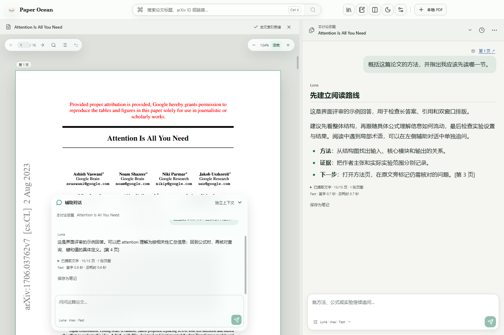

# v1.3.0-preview.1 · 阅读工作台预览

这轮把主要操作串成连续的阅读流程：选文后指定主对话或辅助对话，核对原文附件，再提问、回查引用和保存笔记。它是供日常试读的候选版，不进入正式自动更新。

## 可体验的变化

- 顶栏缩至 56px；论文标题放回阅读区，只有多篇打开时才显示标签栏。布局、字号和低频设置按需展开，答案采用正文排版。新用户对话字号为 16px，已有字号偏好保留。
- 资料库改为非模态侧栏，打开时仍能操作原文。归档、分类及来源管理继续可达。
- 选文菜单提供“问主对话”“问辅助对话”。附件按讨论保存，可以展开、移除或返回原文；发送后的问题仍保留摘录及来源。查看其他 PDF 不会悄悄改变主讨论绑定的论文。
- 保存回答为笔记后留在当前阅读位置，实际写入完成才显示“已保存”，提供查看和撤销。笔记默认筛选当前论文；全部笔记中仍可访问没有来源的旧记录。主、辅助回答都可保存并返回来源。
- 主辅草稿在输入窗口内更新，暂停约 300ms 后合并保存；切换、发送、关闭前立即补齐。两路回答分别订阅消息，定期合并保存，完成、停止与关闭会强制保存末尾内容。
- 修复快速 A→B→A 切论文时复用已销毁 PDF 对象引起的白屏，并取消离开论文后仍未执行的定位回调。

Luna max Fast、全文及相关页证据预算、独立线程、原文归档目录和分类规则保持原有行为。新增记录字段是可选字段，没有更换资料库存储格式。

## 本轮架构边界

已拆出工作区控制器、双路对话运行模块、逐消息订阅、本地草稿缓冲以及工具栏与来源附件组件。PDF 生命周期按论文隔离。原有原子保存与关闭等待机制继续使用。

这是[迭代计划](ui-architecture-plan.md)的第一条完整流程和主要状态接入。通用浮层组件的全面统一、长历史窗口化、百页 PDF 加 200 条历史的组合压力测试、React profiling 构建和跨平台人工试读仍需后续完成；不把本次局部测试当成这些工作已经验收。

## 验证

- 157 项自动测试通过，类型检查与生产构建通过。
- 真实 Electron 窗口验证了：双路同时发送及输出隔离、停止失败重试、快速切论文、中文输入法、跨论文草稿、选文附件、引用返回、就地笔记、撤销与保存恢复。
- 工作台覆盖 1180/1440px 三种布局、拖动松手保存、键盘调整、抽屉的 Esc 层级与焦点、当前/全部笔记、明暗主题以及减少动态/透明度设置。
- 模糊搜索回归继续通过，包括本地拼写容错、最新查询结果隔离、在线备用来源和中文输入法。

受控性能测试使用真实 Electron、独立临时数据和模拟双路 IPC 输出，软件绘制，约 8.67 秒：

| p95 指标 | 主对话 | 辅助对话 |
| --- | ---: | ---: |
| 模拟 IPC 发出至可见文字帧 | 70.4ms | 71.9ms |
| 输入事件至下一帧 | 9.1ms | 11.0ms |

360 个输出分片、72 次输入均验证保留；这次测量未出现超过 33ms 的帧间隔或长任务。可见帧采用文字进入滚动视口后的两次动画帧回调估算，并未测量显示器的实际呈现时刻。运行脚本为 `scripts/measure-workspace-response.mjs`，[完整测量数据](ui-architecture-assets/response-measurement.json)保留了环境与方法。这些数字只说明受控负载下的界面响应，不代表真实模型首字等待，也不代表所有设备和长文场景的表现。

## 试读与回退

先退出正在运行的 Paper Ocean，再启动便携预览版。试读时重点体验：选一段原文分别追问两个窗口；打开引用再返回；保存回答为笔记后继续读；连续切换几篇论文。

预览版沿用已有本地资料库，并新增独立保存的选文附件。保留正式版安装及原有资料库备份；退出预览版后可重新启动 v1.2.5。正式版不会自动升级到此预览版本。跨平台构建和连续读几篇真实论文的主观体验，不能由 Windows 模拟问答测试替代。
